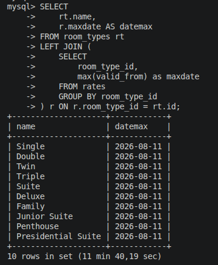
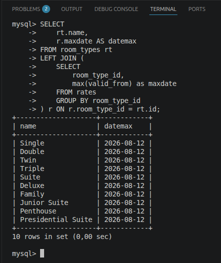
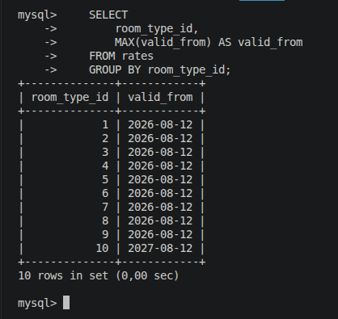
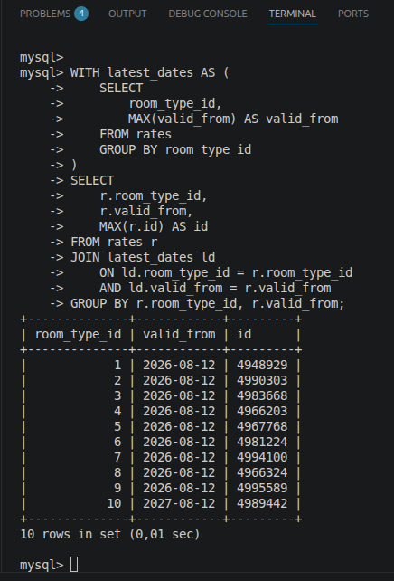
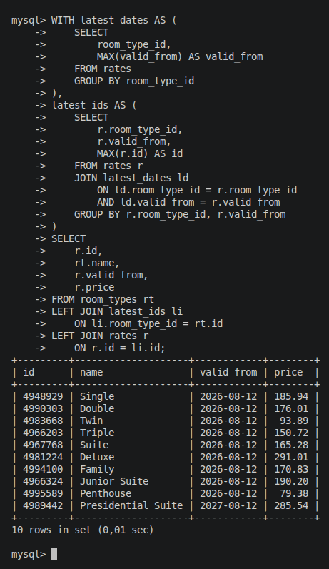

# Decisiones del backend
## ¿Por qué el controlador esta en una API?

Creo que es importante que al tener dos repositorios separados tengamos definido que el backend sea una api ya que así en el frontend podemos trabajar mejor sin preocuparnos de que nos devuelva HTML renderizado ya que esto luego es engorroso para trabajar. 

```sh
php artisan install:api
```

## Los modelos, factories y seeders
Los modelos erán bastante simmples y lo unico que he hecho ha sido definir la relacion de uno a muchos y a la inversa:

```php 
//Models/RoomTypes.php
public function rates(): HasMany
{
    return $this->hasMany(Rate::class);
}

//Models/Rate.php
public function roomType(): BelongsTo
{
    return $this->belongsTo(RoomTypes::class);
}
```

Aparte he puesto los casts necesarios en Rate y el fillable en los dos para poder hacer create() de manera segura.

Para hacer los seeders he usado primero los factories para poder generar datos falsos rapido. Me he apoyado de la IA aqui aunque es basico lo que ha hecho. Lo importante es que al ejecutar las migraciones (Al hacer docker compose up he metido que se ejecutan solas) se ejecuta el DatabaseSeeder.php cuyo metodo llama a los sseeders de las dos tablas. Uno despues del otro porque Rates depende de las claves de room_types: 

```php
public function run(): void
{
    $this->call([
        RoomTypeSeeder::class,
        RateSeeder::class,
    ]);
}
```
## Primer ejecercicio 
**Muestra, por cada tipo de habitación, cuántas tarifas tiene y su precio medio. Una fila por tipo de
habitación**

(Las pruebas las hago con 5 millones de rows en Rate para así poder hablar de indices y optimizaciones y no dejar esto simplemente como un select)

Aqui lo que he hecho ha sido lo siguiente. Lo que queremos es coger los tipos de room y luego contar cuantas filas hay para cada uno y despues hacer el precio medio de estos. A mi me gusta primero pensar en la consulta SQL y luego trasladarla al ORM, por lo que la consulta sería esta: 

```sql 
SELECT
    name,
    (
        SELECT COUNT(*)
        FROM rates
        WHERE room_types.id = rates.room_type_id
    ) AS rates_count,
    (
        SELECT AVG(rates.price)
        FROM rates
        WHERE room_types.id = rates.room_type_id
    ) AS rates_avg_price

FROM room_types;
```
Esta consulta va bien y es facil hacer la transcripcion al ORM:

```php 
$roomTypes = RoomType::query()
    ->select(['name'])
    ->withCount('rates')
    ->withAvg('rates', 'price')
    ->get();
``` 
Sobre 5 millones de registros estoy consiguiendo un tiempo de 12 segundos por la query. Haciendo un ANALYZE de la query se puede ver donde esta el cuello de botella:

```sh
-> Table scan on room_types  (cost=1.25 rows=10) (actual time=0.0263..0.0397 rows=10 loops=1)
-> Select #2 (subquery in projection; dependent)
    -> Aggregate: count(0)  (cost=111769 rows=1) (actual time=137..137 rows=1 loops=10)
        -> Covering index lookup on rates using rates_room_type_id_foreign (room_type_id=room_types.id)  (cost=56365 rows=554041) (actual time=4.66..117 rows=500000 loops=10)
-> Select #3 (subquery in projection; dependent)
    -> Aggregate: avg(rates.price)  (cost=136170 rows=1) (actual time=1085..1085 rows=1 loops=10)
        -> Index lookup on rates using rates_room_type_id_foreign (room_type_id=room_types.id)  (cost=80766 rows=554041) (actual time=20.3..1044 rows=500000 loops=10)
```

Aqui como se ve lo que mas coste tiene en la consulta es el avg(). Esto pasa según entiendo porque aunque tengamos un indice sobre room_type_id por la FK a lhacer el AVG hay que volver a recorrer rates para encontrar los precios de estas filas. Es decir: 1. Encontramos los room_types 2. Como tenemos el indice el count() puede realizarse sobre el indice y no fila a fila 3. Al momento de hacer el average aunque es cierto que tenemos las filas que pertenecen a x room_type_id tenemos que ir fila por fila otra vez a buscar el price para calcular este average.

Por lo que el cuello de botella se resolveria si nuestro indice tambien guardara el price (Un indice es costoso y si la tabla fuera muy general y recibiera todo tipo de queries entiendo que esto sería discutible pero me voy a aprovechar de que para esta prueba estamos en este caso concreto!). Añadimos el indice (lo he puesto en la migracion ya para que se meppiece ya así):
```sql 
CREATE INDEX rates_room_type_id_price_index
ON rates (room_type_id, price);
```

Y ahora vemos que pasamos de 12 segundos a 1.4 de media!! Mirando el analyze de exactamente la misma query se puede ver la mejora:
```sh
| -> Table scan on room_types  (cost=1.25 rows=10) (actual time=0.0256..0.0408 rows=10 loops=1)
-> Select #2 (subquery in projection; dependent)
    -> Aggregate: count(0)  (cost=112226 rows=1) (actual time=78.7..78.7 rows=1 loops=10)
        -> Covering index lookup on rates using rates_room_type_id_price_index (room_type_id=room_types.id)  (cost=56822 rows=554041) (actual time=0.776..62.5 rows=500000 loops=10)
-> Select #3 (subquery in projection; dependent)
    -> Aggregate: avg(rates.price)  (cost=112226 rows=1) (actual time=103..103 rows=1 loops=10)
        -> Covering index lookup on rates using rates_room_type_id_price_index (room_type_id=room_types.id)  (cost=56822 rows=554041) (actual time=0.508..67.8 rows=500000 loops=10)
``` 
Se ve que ahora usamos el indice y como no tenemos que volver a ir fila a fila! 

Esto se puede seguir mejorando ya que ahora mismo como se ve en el explain estamos haciendo dos consultas separadas, es decir sobre rates hacemos el count y luego el average, aunque con el indice esta operacion es muy eficiente es como si realmente estuvieramos recorriendo 5 millones + 5 millones de filas. Por lo que si en la query puedo poner que sobre rates se hagan las operaciones a la vez bajaría más el tiempo. Pasandole este analisis a la IA me ha dado esta query con el group by y el left join que hacen exatamente eso, solo iterar una vez:
```sql
SELECT
    rt.name,
    COALESCE(r.stats_count, 0) AS rates_count,
    r.avg_price AS rates_avg_price
FROM room_types rt
LEFT JOIN (
    SELECT
        room_type_id,
        COUNT(*) AS stats_count,
        AVG(price) AS avg_price
    FROM rates
    GROUP BY room_type_id
) r ON r.room_type_id = rt.id;
```
Con esto pasamos de 1.4 segundos a a 0.85 segundos! Y a partir de aqui creo que no se puede hacer nada ya que el coste de la consulta crece linealmente con el numero de filas, habría que tomar otro tipo de estrategias como filtrar por una fecha x hasta otra y o inlcuso cachear esta operacion si rates no cambia cada segundo. 
## Primer ejercicio. Parte dos 
Voy a partir de la query anterior porque ha demostrado ser optima. 

```sql
SELECT
    rt.name,
    r.maxdate AS datemax
FROM room_types rt
LEFT JOIN (
    SELECT
        room_type_id,
        max(valid_from) as maxdate
    FROM rates
    GROUP BY room_type_id
) r ON r.room_type_id = rt.id;
``` 
Esta query ha tardado 5 minutos y 40 segundos! 


Esto es porque ahora no tenemos ningun indice por lo que para encontrar el valor maas alto de la fecha hay que recorrer los 5 millones de filas. Si añadimos un indice con room_type_id y la columna valid_from bajamos a un tiempo unico de ~0.01 segundos
```sql
CREATE INDEX rates_room_type_id_valid_from_index
ON rates (room_type_id, valid_from);
```


Aqui surge la pregunta de porque no crear un indice con room_type_id, price y valid_from. Lo he estado probando y este indice hace que en el caso de calcular el average de los precios siga funcionando bien pero en el caso de que solo queramos las fechas mas altas la consulta tarda exactamente lo mismo que con price. La diferencia es enorme por lo que para este caso creo que es mejor tener los dos indices separados. Como había comentado antes esta velocidad no es gratis y afectará a la tabla al momento de hacer inserts/updates,etc... por lo que tendriamos que investigar teniendo en cuenta esto tambien y no la velocidad de los selects unicamente. Lo dejo para otra charla esta mejora porque sino no me da tiempo a hacer más! 

Volviendo al tema, esta query ahora mismo solo nos devuelve el room_type y la fecha maxima pero lo que queremos es el precio y tipo de habitacion. Bueno no se si hay mejores soluciones pero aqui he optado por lo siguiente despues de varias pruebas:

    1. Cogemos los room_types_id con el maximo valor de valid_from ya que hemos visto que es algo realmente rapido:
        
       0.00 Segundos por sacar esta informacion lo cual mola 
    2. Como seguramente pueda haber empates, necesitamos coger el max id y "cuadrarlo" con los valores que hemos obtenido antes. Aqui voy a utlizar with para   agrupar las subconsultas (el with me lo ha puesto la ia para agrupar las subconsultas y que quede legible) por lo que abandono completamente el uso de Eloquent. No se como puntua esto pero viendo el tiempo final que nos va a dar esta query creo que merece la pena saltarselo: 
        
        Como se ve esto no ha tardado nada ya que solo hemos tenido que iterar sobre el indice de las rows con max valid_from!
    3. Ahora simplemente con los ids que tenemos sacamos la informacion que nos interesa, en este caso el price. La query total para obtener el precio de la ultima fecha valida (y con desempate por id si fuera necesario) solo tarda 0.01 segundos. 
        

No se si hay formas mas faciles de hacer esto, he intenado simplificar mucho mas la query para poder meterla en el orm pero no he sido capaz. Pero defiendo esta solucion porque estamos dejando el orm a cambio de una velocidad increible en la parte del codigo. 

Query completa: 
```sql
WITH latest_dates AS (
    SELECT
        room_type_id,
        MAX(valid_from) AS valid_from
    FROM rates
    GROUP BY room_type_id
),
latest_ids AS (
    SELECT
        r.room_type_id,
        r.valid_from,
        MAX(r.id) AS id
    FROM rates r
    JOIN latest_dates ld
        ON ld.room_type_id = r.room_type_id
        AND ld.valid_from = r.valid_from
    GROUP BY r.room_type_id, r.valid_from
)
SELECT
    r.id,
    rt.name,
    r.valid_from,
    r.price
FROM room_types rt
LEFT JOIN latest_ids li
    ON li.room_type_id = rt.id
LEFT JOIN rates r
    ON r.id = li.id;
```

## Manejo de errores en /api/* 

explicar lo de app.php en el boostrap


# Decisiones del frontend 

Aquí la cosa se me ha complicado mucho porque no he tocado nunca quasar y muy poco de Vue. Claramente la IA me ha ayudado mucho y al final he conseguido un buen resultado. 

## La implementacion de fibonacci 

Aquí la verdad que ha sido sencillo ya que por lo que se pide se puede ir directamente a una solucion optima. Si por ejemplo se pide el n numero de la sucesion entonces lo primero que se piensa es en una solucion con recursividad lo cual esta bien, pero para mejorar esto habría que añadir un cache para no tener que calcular todo el rato f(x-1) + f(x-2). 

Pero como tenemos que enseñar la tabla, si o si tenemos que guardar los numeros por lo que la implementacion es tan facil como calcular f(x) actual y no resetear el resultado. Con esto hacemos que el calculo del siguiente numero en la lista sea simplemente añadir los dos valores anterioir que nos hemos guardado. En codigo: 

```js

export default function calculateFibonacciRecursive(n) {
  const result = []

  //a y b serian nuestros f(x-1) y f(x-2) en la solucion recursiva
  //he añadido el n porque a partir de la posicion 400 de la sucesion js me devolvia Infinity en vez de el numero
  //con BigInt (es lo que significa la n) he podido llegar hasta mucho mas allá y enseñar todos los numeros 
  //haciendo que el limite ahora este en lo que el ordenador pueda procesa
  let a = 0n
  let b = 1n

  for (let i = 0; i <= n; i++) {
    result.push({
      position: i,
      value: a
    })

    //Solo sumamos los valores anteriores porque los estamos manteniendo todo el rato por lo cual esto ya es optimo y no habria que hacer mucho mas
    const next = a + b
    a = b
    b = next
  }

  return result
}


``` 